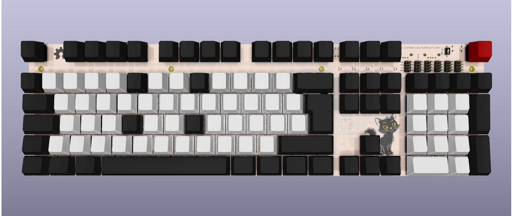
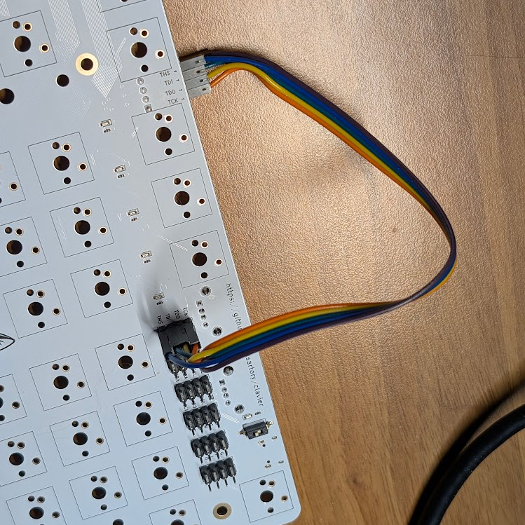

# Clavier

Clavier (French for ‘keyboard’) is an FPGA-based mechanical keyboard with an integrated USB hub, and numerous communication interfaces (JTAG, SPI, I²C, UART).

## Features

- Full size 105 keys ISO keyboard + one extra
- Compatible with PCB mounted Cherry MX switches
- N-key rollover
- 1000 Hz polling rate
- No multiplexing, no ghosting
- 2-port USB 2.0 hub
- JTAG, SPI, I²C, 2 × UART, and 8 × GPIOs
- FPGA-based, VHDL only, no ALU
- Fully open-source, including all design tools (see below)

### What's the extra key for?

It's mapped to F20.
I use it to lock my computer quickly when I leave my desk.

## Required tools

- [KiCad](https://www.kicad.org) for the PCB
- [FreeCAD](https://www.freecad.org) or [OpenSCAD](https://openscad.org) for the housing
- [OSS CAD Suite](https://github.com/YosysHQ/oss-cad-suite-build) (GHDL, Yosys, hdl, ghdl-yosys-plugin, nextpnr-ecp5, ecppack, and openFPGALoader) and [GNU Make](https://www.gnu.org/software/make) for the FPGA

## PCB

The PCB has 4 layers and requires no unusual capabilities to produce.
It is however not easy to assemble by hand mostly due to 0402 passives and the FPGA in BGA packaging.

### Schematics

A PDF version of the schematics is available here, for convenience: [PCB/doc/clavier.pdf](PCB/doc/clavier.pdf).

## Housing

An OpenSCAD version of the housing was created first and is fine for 3D printing.
The FreeCAD version was created afterwards for exporting to STEP, which is more suitable for CNC machining.
Both versions are functionally equivalent.

## FPGA

### How to build

Simply run `make` in the FPGA subfolder.
If using OSS CAD Suite, make sure [the environment is set](https://github.com/YosysHQ/oss-cad-suite-build?tab=readme-ov-file#installation) first.

### How to program

The integrated JTAG interface can be used to program the FPGA.
The switch `SW18` is used to toggle the interfaces on or off. The LED `D1` close by displays the current status.
Connect the JTAG interface with jumper cables, then run either `make prog-sram` or `make prog-flash`, depending on if the configuration needs to be permanent or not.

## Communication interfaces

Except for the GPIOs that are connected directly to the FPGA, communications are handled by the [CH347F](https://www.lcsc.com/datasheet/C18221627.pdf).

## Licenses

- The PCB and housing are licensed under the [CERN Open Hardware Licence Version 2 - Permissive](https://spdx.org/licenses/CERN-OHL-P-2.0.html).
- The FPGA code is licensed under the [MIT Licence](https://spdx.org/licenses/MIT.html).
